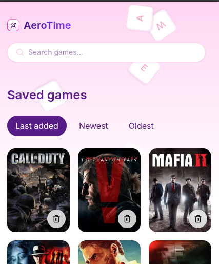

# 🎮 AeroTime

Your gaming legacy, one collection at a time.



## 🛠️ Technologies

- [Next.js 15](https://nextjs.org/)
- [React 19](https://reactjs.org/)
- [TypeScript](https://www.typescriptlang.org/)
- [Tailwind CSS](https://tailwindcss.com/)
- [SWR](https://swr.vercel.app/)
- [Zustand](https://zustand-demo.pmnd.rs/)
- [IGDB API](https://api-docs.igdb.com/)

## 🚀 Quick Start

### Prerequisites

- Node.js 20 or higher
- pnpm
- IGDB/Twitch account for API keys

### Environment Setup

1. Clone the repository:

```bash
git clone https://github.com/TanisJam/aerotime
cd aerotime
```

2. Install dependencies:

```bash
pnpm install
```

3. Create a `.env.local` file with the following variables:

```bash
NEXT_PUBLIC_IGDB_API_URL=https://api.igdb.com/v4
TWITCH_CLIENT_ID=your_client_id
TWITCH_CLIENT_SECRET=your_client_secret
```

4. Run the development server:

```bash
pnpm dev
```

The application will be available at `http://localhost:3000`

